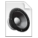

# File type icons {#mimetypeicons .reference}

These icons are provided by HCL Connections™ for displaying files.

## File icons { .section}

|Icon|Description|File extensions \(partial list\)|
|:--:|-----------|--------------------------------|
||generic

|Anything not covered by other images.

|
||text

|.323, .asc, .bas, .c, .etx, .h, .jw, .log, .mcw, .msg, .ow, .pfs, .qa, .rtf, .sow, .text, .tsv, .tw, .txt, .uls, .vw3, .ws, .xy

|
||document

|.doc, .docm, .docx, .dot, .dotm, .dotx, .en4, .enw, .leg, .lwp, .lwp7, .manu, .msw, .mwp, .mwp2, .mwpf, .odc, .odg, .odt, .ort, .otg, .oth, .otm, .ott, .pages, .pcl, .rtx, .std, .stw, .sxd, .sxq, .sxw, .w6, .w97, .wm, .wp5, .wp6, .wpf

|
||data

|.123, .12m, .acs, .csv, .dbs, .dez, .ens, .fcd, .fcs, .mwkd, .mwks, .odf, .ods, .oss, .otf, .ots, .qad, .smd, .sms, .stc, .sxc, .sxm, .wg2, .wk4, .wk6, .xla, .xlam, .xlc, .xlm, .xls, .xlsb, .xlsm, .xlsx, .xlt, .xltm, .xltx, .xlw

|
||presentation

|.flw, .key, .mass, .odp, .ope, .otc, .otp, .pot, .potm, .potx, .pp2, .pp97, .ppam, .pps, .ppsm, .ppsx, .ppt, .pptm, .pptx, .prz, .shw3, .sti, .sxi

|
||Adobe® PDF

|.pdf, .ai, .eps, .ich, .ich6, .iwp, .ps

|
||flash

|.swf, .fla

|
||code

|.asp, .axs, .css, .htc, .htm, .html, .js, .jsp, .php, .sct, .stm, .wml, .xml, .xsl

|
||graphic

|.bmp, .cgm, .cmx, .cod, .djv, .djvu, .drw, .dxf, .eshr, .gif, .hgs, .ico, .ief, .img, .jfif, .jpe, .jpeg, .jpg, .odi, .oti, .pbm, .pcx, .pgl, .pgm, .pic, .pict, .png, .pnm, .pntg, .ppm, .psd, .psp6, .ras, .rgb, .sdw, .svg, .svgz, .tga, .tif, .tif6, .tiff, .wbmp, .wpg, .xbm, .xpm, .xwd

|
||audio

|.aac, .aif, .aifc, .aiff, .au, .kar, .m3u, .m4a, .mid, .midi, .mp3, .mpga, .ra, .ram, .rm, .rmi, .rpm, .snd, .wav, .wma

|
||video

|.asf, .asr, .asx, .avi, .divx, .flv, .lsf, .lsx, .mov, .movie, .mp2, .mp4, .mpa, .mpe, .mpeg, .mpg, .mpv2, .qt, .svi, .wmv

|
||compressed

|.cab, .dmg, .gtar, .gz, .jar, .rar, .sit, .sqx, .tar, .taz, .tgz, .z, .zip

|
||contact

|.crd, .vcard, .vcf, .vcrd

|

**Parent topic:**[Customizing file type icons](../customize/t_admin_files_customize_icons.md)

