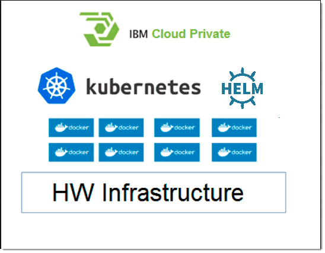

# Component Pack overview {#c_Orient_Me_architecture_diagrams .concept}

Review the underlying architecture and technologies used by the Component Pack for HCL Connections™.

Component Pack for Connections is both designed and deployed upon a different software stack from Connections 6.0. Therefore, it requires a separate hardware infrastructure from Connections 6.0. Its architecture consists of four main components:

-   [Container Manager \(Docker\)](https://www.docker.com/)

    Using containers, everything required to make a piece of software run is packaged into isolated containers. Unlike VMs, containers do not bundle a full operating system - only libraries and settings required to make the software work are needed. This makes for efficient, lightweight, self-contained systems and guarantees that software will always run the same, regardless of where it’s deployed.

-   [Container orchestrator \(Kubernetes\)](https://kubernetes.io/)

    Kubernetes is an open-source platform for automating deployment, scaling, and operations of application containers across clusters of hosts, providing container-centric infrastructure.

-   [Container Platform \(IBM® Cloud Private\)](https://www.ibm.com/developerworks/community/blogs/fe25b4ef-ea6a-4d86-a629-6f87ccf4649e?lang=en)

    IBM Cloud Private is an on-premises platform for managing containerized applications that is based on the container orchestrator Kubernetes. IBM Cloud Private also includes a graphical user interface which provides a centralized location from where you can deploy, manage, monitor and scale your applications.

-   [Package Manager for Kubernetes \(Helm\)](https://helm.sh)

    Helm helps you manage Kubernetes applications — Helm Charts helps you define, install, and upgrade even the most complex Kubernetes application.

This diagram illustrates the architecture of the Component Pack.

The architecture components are deployed across a range of nodes from a single VM \(for evaluation purpose only\) to multiple VMs \(depending on scale required\). During the installation you will need to provide IPv4 address to each of those. The following table describes the required nodes.

|Node|Description|
|Boot node|A boot or bootstrap node is used for running installation, configuration, node scaling, and cluster updates. Only one boot node is required for any cluster. This node must be the same node as master.

|
|Master node|A master node provides management services and controls the worker nodes in a cluster. Master nodes host processes that are responsible for resource allocation, state maintenance, scheduling, and monitoring.

 **Note:** Multiple master nodes are required in a high availability \(HA\) environment to allow for failover if the leading master host fails. Host that can act as the master are called master candidates.

|
|Worker node|A worker node is a node that provides a containerized environment for running tasks. As demands increase, more worker nodes can easily be added to your cluster to improve performance and efficiency. A cluster can contain any number of worker nodes, but a minimum of one worker node is required.

 There are two types of worker nodes for Component Pack, generic worker and infrastructure worker. See [Adding or removing worker nodes](r_Orient_Me_adding_or_removing_workers.md) for more information.

|
|Proxy node|A proxy node is a node that transmits external request to the services created inside your cluster. Multiple proxy nodes are deployed in a high availability \(HA\) environment to allow for failover if the leading proxy host fails. A single node can be used as both master and proxy. However, it is best to have dedicated proxy nodes. A cluster must contain at least one proxy node if load balancing is required inside the cluster.

|

The installation package uses IBM Cloud Private \(ICp\) to manage the components required for Component Pack.

The installation package relies on Docker container technology and includes some of these Open Source components:

-   Apache ZooKeeper enables highly reliable distributed coordination of group services used by an application.
-   MongoDB is an open-source database that uses a document-oriented rather than relational data model.
-   Redis is an open source \(BSD licensed\), in-memory data structure store, used as a database, cache and message broker.
-   Solr provides distributed indexing, replication and load-balanced querying, automated failover and recovery, and centralized configuration.
-   OpenSearch is a community-driven, Apache 2.0-licensed open source search and analytics suite that makes it easy to ingest, search, visualize, and analyze data

