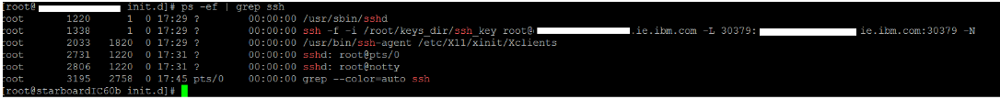

# Securing Redis traffic to Orient Me \(Linux\) {#cp_config_om_redis_secure_linux .task}

Follow these steps to secure the traffic flowing between the HCL Connections™ applications and the Orient Me home page.

This is an optional, but recommended step. To encrypt Redis traffic from Connections to the Orient Me home page, configure a Secure Shell \(SSH\) tunnel. An SSH tunnel consists of an encrypted tunnel created through an SSH protocol connection.

**Note:**

-   Instructions are for securing Connections servers running on Linux connecting to the Orient Me home page.
-   Redis is designed for use within a trusted private network, and does not support SSL encrypted connections.
-   This procedure must be performed on every node\\server in your environment that communicates with Orient Me. For example, run this on the Deployment Manager and all physical nodes.

1.  Log in as a user with sudo access to your Connections server.

2.  Configure the SSH connection:

    -   `sudo mkdir -p keys_dir`
    -   `echo y | sudo ssh-keygen -t rsa -f keys_dir/ssh_key -P '' || error_cleanup 2 "ssh-keygen failure (no prompt)"`
    -   `sudo chmod 600 keys_dir/ssh_key`
    -   `sudo ssh-copy-id -o StrictHostKeyChecking=no -i keys_dir/ssh_key root@IP\_address\_of\_master\_node || error_cleanup "ssh_key copy failure to node (no prompt)"`

        **Note:** If using HA, you must specify each master IP in turn. For example:

        -   `- sudo ssh-copy-id -o StrictHostKeyChecking=no -i keys_dir/ssh_key root@<IP\_address\_of\_master\_1> || error_cleanup "ssh_key copy failure to node (no prompt)"`
        -   `- sudo ssh-copy-id -o StrictHostKeyChecking=no -i keys_dir/ssh_key root@<IP\_address\_of\_master\_2> || error_cleanup "ssh_key copy failure to node (no prompt)"`
        -   `- sudo ssh-copy-id -o StrictHostKeyChecking=no -i keys_dir/ssh_key root@<IP\_address\_of\_master\_3> || error_cleanup "ssh_key copy failure to node (no prompt)"`
3.  Enter the password of the sudo user.

4.  Create the SSH tunnel:

    1.  Create a new file: sudo touch /etc/init.d/OMsshkey

    2.  Enter `sudo vi /etc/init.d/OMsshkey`

    3.  Type i to insert text and add the following:

        ```
        #!/bin/bash
        ### BEGIN INIT INFO
        # Provides:            OMsshkey
        # Required-Start:      $local_fs $network $remote_fs $named $time
        # Required-Stop:       $local_fs $network $remote_fs $named
        # Default-Start:       2 3 4 5
        # Default-Stop:        0 1 6
        # Short-Description:   Starts SSH Tunnel from HCL Connections to Orient Me
        # Description:         Starts SSH Tunnel from HCL Connections to Orient Me
        ### END INIT INFO 
        ssh -f -i path\_to\_SSH\_key root@IP\_or\_Host\_name\_of\_master -L 
        30379:IP\_or\_Host\_name\_of\_master>:30379 -N
        ```

        For example:

        ```
        ssh -f -i /root/keys_dir/ssh_key root@1.2.3.4 -L 30379:1.2.3.4:30379  -N
        ```

        Where:

        -   The -f tells ssh to go into the background just before it executes the command.
        -   This is followed by the user name and server you are logging into.
        -   The -N instructs OpenSSH to not execute a command on the remote system.
        **Note:** If deploying for high availability, specify the floating IP address for master servers when specifying the IP\_or\_Host\_name\_of\_master.

    4.  Press Esc, then type :wq and press Enter to close and save the file.

5.  Open a terminal window and issue the following commands:

    ```
    sudo chmod 755 /etc/init.d/OMsshkey 
    sudo service OMsshkey start 
    ```

6.  Configure the SSH Tunnel to be persistent on reboot.

    1.  Enter `sudo vi /etc/rc.local`

    2.  Type i to insert text, and then\\append the following to the end of the file: `/etc/init.d/OMsshkey start`

    3.  Press **Esc**, then type :wq and press **Enter** to close and save the file.

    The SSH Tunnel will now be started and will be persistent upon reboot.

7.  To verify that the tunnel has started successfully, enter `ps –ef | grep ssh`

    You should see a running process 'ssh –f -I ...'

    For example: 


**Parent topic:**[Enabling and securing Redis traffic to Orient Me](../install/cp_config_om_redis_traffic.md)

