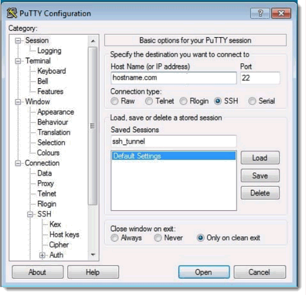
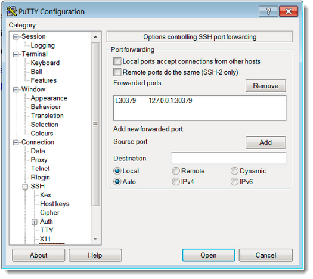
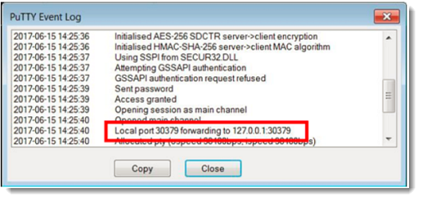

# Securing Redis traffic to Orient Me \(Windows\) {#cp_config_om_redis_secure_windows .task}

If your deployment runs HCL Connections™ on Windows, secure Redis traffic by creating a tunnel between Connections on Windows and the Orient Me services \(running on Linux\). This is an optional, but recommended, step.

These instructions explain how to create the SSH tunnel using PuTTY configured to run as a service. To perform this task, you must install the following software:

-   For Orient Me:
    -   Open SSH
-   For Connections:
    -   PuTTY
    -   Redis client

1.  On Connections, set up the SSH connection:

2.  In PuTTY, enter the host name or IP address of the Kubernetes master node, make sure the "Connection Type" is SSH, and enter a name of your choice in the "Saved Sessions" section.

    

3.  Click **Category** \> **Connection** \> **SSH** \> **Tunnels** and select the ports for "Source" and "Destination".

    The Source port will be 30379 \(default Redisnode\_port\) and for convenience, this example uses the same port as the destination.

    For "Source Port" enter the Redisnode\_port and as the "Destination" enter 127.0.0.1:destination \(in this case 127.0.0.1:30379\). Press "Add" and you will see something like this: 

4.  Select **Category** \> **Session** and click "Save" to ensure that the changes can be loaded in the future.

5.  Click **Open**.

    A PuTTY session launches.

6.  Log in to the server as normal and exchange keys if prompted.

7.  To test if the tunnel is working, right-click on the PuTTY window and select **Event Log**.

    If the tunnel has been set up correctly, the log will contain an entry informing you of local port forwarding. 

8.  Test the tunnel connection.

    To test the tunnel connection, you can use any Redis management tool. The following example uses Redis Desktop Manager \(available at https://redisdesktop.com\). Start by opening the Redis Desktop Manager and selecting **Connect to Redis Server**.

9.  Enter the following for the tunnel connection:

    -   **Name**: enter a name of your choice for the connection. For example: ssh\_tunnel
    -   **Host**: set to localhost
    -   **Port**: the port number used for the destination in the tunnel. For example: 30379.
    -   **Auth**: the Redis password configured.

        Once you have set your details, press "Test Connection". If everything is correct you will see a success message.

10. Click **Test Connection**. X

    If everything is correct, you will see a success message:Successful connection to the redis-server.

11. Click **OK** to dismiss the status window then click **OK** to close the configuration window.

12. Click **Import/Export** and export the tunnel setup for future use.

    **Tip:** Double-click a tunnel name to view and manage all of the running Redis databases.

**Parent topic:**[Enabling and securing Redis traffic to Orient Me](../install/cp_config_om_redis_traffic.md)

