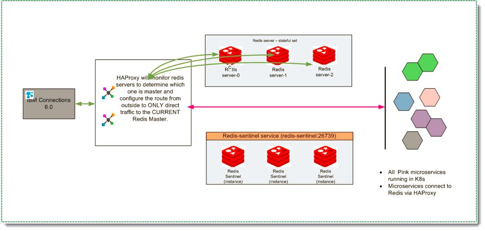

# Enabling and securing Redis traffic to Orient Me {#cp_config_om_redis_traffic .concept}

HCL Connections™ requires some additional configuration to know how to securely communicate with the Orient Me home page.

Component Pack supports the following Redis capabilities for regulating traffic for Orient Me:

-   High Availability \(HA\)
-   HA Proxy
-   Redis Security -Authentication
-   Updated configureRedis.sh script

Redis High Availability \(HA\) via Redis Sentinel
:   Using the capabilities of Redis Sentinel, Component Pack runs a Redis Sentinel Cluster \(1 Redis master, 2 Redis slaves, 3 Sentinels\) that resists, without human intervention, certain kinds of failures. Sentinel capabilities include:

    -   Monitoring. Sentinel constantly checks if your master and slave instances are working as expected.
    -   Automatic failover. If the master is not working as expected, Sentinel can start a failover process where a slave is promoted to master, the other additional slaves are reconfigured to use the new master, and the applications using the Redis server informed about the new address to use when connecting.

HA proxy
:   Component Pack supports HA Proxy to provide a route from Connections 6.0 to the Redis Cluster running within Component Pack. The HA Proxy runs as a separate deployment on Component Pack and its purpose is to provide an external entry point for traffic from Connections 6.0 to the Redis Cluster running within Component Pack. When configuring Connections to connect with Component Pack, we now specify the port that the HA Proxy is running on.

HA proxy - Authentication
:   Component Pack supports Redis Security via Redis Authentication. Redis Clients connecting with Redis must authenticate using the Redis password set during the ICp deployment. Note the following considerations:

    -   Redis Authentication can be enabled\\disabled via a setting in the configuration map. Default is Authentication Enabled.
    -   When configuring Connections 6.0, you must set the Redis Password

Updated configureRedis.sh script
:   The updated configureRedis.sh script includes the following:

    -   The ability to set or clear the Redis Password in Connections.
    -   Flags for setting input parameters.

The Redis topology works as follows:

Follow these steps to configure and secure the Redis traffic flowing between Connections and Component Pack.

-   **[Manually configuring Redis traffic to Orient Me](../install/cp_config_om_redis_enable.md)**  
Configure Redis traffic between the HCL Connections applications and the Orient Me home page.
-   **[Securing Redis traffic to Orient Me \(Linux\)](../install/cp_config_om_redis_secure_linux.md)**  
Follow these steps to secure the traffic flowing between the HCL Connections applications and the Orient Me home page.
-   **[Securing Redis traffic to Orient Me \(Windows\)](../install/cp_config_om_redis_secure_windows.md)**  
If your deployment runs HCL Connections on Windows, secure Redis traffic by creating a tunnel between Connections on Windows and the Orient Me services \(running on Linux\). This is an optional, but recommended, step.
-   **[Verifying Redis server traffic](../install/cp_config_om_redis_verify.md)**  
Confirm that traffic is flowing properly from HCL Connections to the Orient Me home page.

**Parent topic:**[Configuring the Orient Me component](../install/cp_config_om_intro.md)

