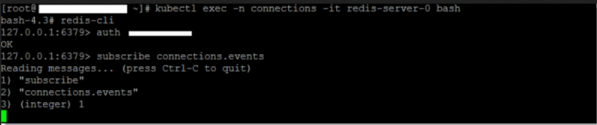
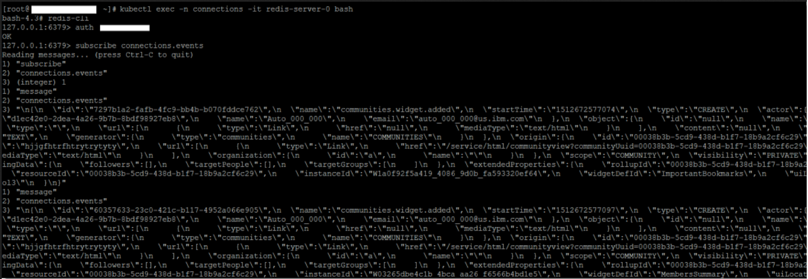

# Verifying Redis server traffic {#cp_config_om_redis_verify .task}

Confirm that traffic is flowing properly from HCL Connections™ to the Orient Me home page.

The following steps are to validate that traffic is flowing from Connections to the Orient Me home page.

1.  Connect to your running Redis pod on the master server.
2.  Log in to the master server and connect to your running Redis pod.

    Note the following if you are deploying for high availability:

    -   In a Redis HA set up, there are 3 running Redis servers \(redis-server-0, redis-server-1, redis-server-2\). One is a master and two are slaves that replicate all content with the master server.
    -   Upon installation of Redis HA, the pod running as redis-server-0 assumes the master role and redis-server-1 and redis-server-2 assume the slave role.
    -   In a failover scenario, redis-server-1 or redis-server-2 can assume the master role if the Redis master becomes unavailable.
    -   Because all Redis servers are replicas of each other, you can connect to any Running Redis instance to see Redis traffic flowing from Connections to Orient Me.
    1.  Log in as root to the master server.

    2.  Enter this command to connect to the Redis pod:

        ```
        kubectl exec -it -n connections redis-server-0 bash
        ```

        You will now be in the container, at the data directory.

3.  Subscribe to the `connections.events` channel.
4.  To subscribe to the Redis `connections.events` channel you must first connect and authenticate with the password \(secret\) set during [bootstrap installation](cp_install_bootstrap.md).

    **Note:** If you configured SSH tunnelling, validate that the SSH Tunnel is working before you connect to the running Redis pod on the master server.

    1.  Connect to the Redis server:

        ```
        redis-cli
        ```

    2.  Authenticate with the server:

        ```
        auth redis-password
        ```

    3.  Subscribe to the channel:

        ```
        subscribe connections.events
        ```

    For example: 

5.  Validate that events are populated in the connections.events channel
6.  Follow these steps to validate that events are populated in the connections.events channel.

    1.  Keep the channel from the previous step open, and browse to the home page of your Connections server.

    2.  Log in as a user with rights to create a community.

    3.  Create a community, then switch back to the Redis pod. You should see events being posted in the channel.

        For example: 

7.  Validate that the SSH Tunnel is working
8.  Log on to each machine where you installed the SSH Tunnel.

    1.  Enter the following to ensure the tunnel process is running:

        ```
        ps -ef | grep ssh
        ```

    2.  Confirm that you see the ssh tunnel is running as a process -ssh -f -I keys\_dir/ssh\_key ....

9.  Follow these steps to use Telnet to connect to our ssh tunnel and set a Redis key value pair on the master node.

    1.  If Telnet is not already installed, enter the following to install it.

        ```
        sudo yum -y install telnet
        ```

    2.  Telnet:

        ```
        sudo telnet localhost 30379
        
        ```

    3.  If Redis authenication is enabled \(default is enabled\), you must authenticate before you can set a key:

        ```
        auth <Redis password>
        ```

    4.  Set a Redis key value. For example, set:

        ```
        SET today Friday
        ```

        The message +OK displays to indicate that the value "Friday" was set for the key "today".

    5.  Type the following to exit the Telnet session.

        ```
        quit
        ```

10. Follow these steps to retrieve the value of the key set on your Connections server:

    1.  Log in as root to the master server.

        Because all Redis servers are replicas of each other, you can connect to any Running redis instance to see Redis Traffic flowing from Connections to Orient Me

    2.  Enter this command to connect to the running Redis pod on the system:

        ```
        kubectl exec -n connections -it redis-server-0 bash
        ```

        You will now be in the container, at the data directory.

    3.  Enter the following commands to authenticate to Redis and retrieve the key value set in Step 5:

        ```
        bash-4.3# redis-cli
        127.0.0.1:6379> AUTH <redis-password>
        OK
        127.0.0.1:6379> GET today
        "Friday"
        ```

    4.  Run the test again with another key pair. The key pair test confirms that using the ssh tunnel, a value is retrieved from the Connections server and set in the in-memory storage of the Redis pod running on the master node. This proves that the ssh tunnel is working as expected.


If Connections events don't appear in the connections.events channel when you create a community, follow these steps to resolve the problem:

1.  Ensure that the Redis pod is running:
    1.  Log in to the master server
    2.  Enter this command to view the running Redis pod on the system:
        -   `kubectl get pods -n connections | grep redis`
        -   Confirm that the pod is showing a running status with readiness being 1/1. For example,

            redis-server-0 1/1 Running 0 4h

            redis-server-1 1/1 Running 0 4h

            redis-server-2 1/1 Running 0 4h

2.  Ensure that the SSH Tunnel is configured properly. Review the steps in the procedure for validating that the tunnel is working.
3.  Restart the appropriate application for settings to take immediate effect. As there is a delay in Highway settings propagating to all services in a clustered environment you may need to restart the appropriate application \(for example, News for Redis export support\) to see the settings take immediate effect.
4.  Check the System.Err logs on the Connections server. Look to see if the following exceptions are in the log:

    ```
        SystemErr     R Caused by: java.net.UnknownHostException: http://your\_master\_host\_name 
    
        [18/05/17 09:47:21:308 IST] 000001f0 SystemErr     R     at java.net.AbstractPlainSocketImpl.connect(AbstractPlainSocketImpl.java:214) 
    
        [18/05/17 09:47:21:308 IST] 000001f0 SystemErr     R     at java.net.SocksSocketImpl.connect(SocksSocketImpl.java:403) 
    
        [18/05/17 09:47:21:308 IST] 000001f0 SystemErr     R     at java.net.Socket.connect(Socket.java:666) 
    
        [18/05/17 09:47:21:308 IST] 000001f0 SystemErr     R     at redis.clients.jedis.Connection.connect(Connection.java:184) 
    
        [18/05/17 09:47:21:308 IST] 000001f0 SystemErr     R     ... 14 more 
    ```

    To resolve these errors, ensure when running the configureRedis.sh script that the setting for Master Server Hostname/IPAddress does not include http or https.


**Parent topic:**[Enabling and securing Redis traffic to Orient Me](../install/cp_config_om_redis_traffic.md)

