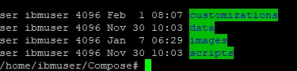

# Installing Customizer Lite {#cp_install_customizer_lite .task}

This topic describes how to install Customizer Lite. There are two deployment options, hereby referred to as Customizer Lite and Customizer Lite HA. Customizer Lite – the most basic deployment using a single Docker node running a single instance of each required service and Customizer Lite HA – a more resilient deployment using a pair \(or more\) of Docker nodes all running instances of each required service with requests load balanced across available nodes.

Prerequisites before installing Customizer Lite:

**Note:** Kubernetes is NOT required.

-   Docker
-   Docker Compose
-   Setting up a reverse proxy

**Docker**

[Make sure that you install Docker properly](https://kubernetes.io/docs/setup/production-environment/container-runtimes/#docker), and install the same Docker configuration on each of the virtual machines.

**Docker Compose**

The following will install the latest stable version on RHEL 7.6/CentOS 7.6. \(Customizer docker-compose script requires a minimum version 1.22\). Repeat on each of the virtual machines so that they all have the same docker-compose configuration.

-   Additional packages

    ```
    sudo yum install epel-release
    ```

-   Install python pip:

    ```
    sudo yum install python-pip
    ```

-   Install docker-compose

    ```
    sudo pip install docker-compose
    ```

-   Upgrade python packages on Cent0s for docker-compose

    ```
    sudo yum upgrade python*
    ```

-   Test docker-compose installation on each of the virtual machines

    ```
    docker-compose version
    ```


**Setting up a reverse proxy**

Customizer Lite requires the use of a reverse proxy. The following is an example using NGINX .

Refer to steps 4 through 10 in the following topic: [Configuring the NGINX proxy server for Customizer](cp_config_customizer_setup_nginx.md).

The following steps provide the instructions for installing Customizer Lite and the configuration changes required for Connections to enable Customizer.

If deploying Customizer Lite, the files can be installed on the local storage of the single virtual machine.

If deploying Customizer Lite HA with multiple Docker nodes, place the files on a shared volume \(such as NFS for Linux or SMB for Windows\) so that all Docker nodes can mount and share the same Docker images and service configuration files. Mount the shared volume into the file system of each virtual machine before making the changes outlined below. Steps 1-7 below should only need to be performed once if directories are shared and mounted properly on each Docker node; step 8 is repeated on all nodes to start the services.

1.  Copy the Customizer Lite archive onto the required storage volume \(either local or shared\).

2.  Extract the archive into the storage location, for example into a directory named customizerLite. There should be four subdirectories as shown below:

    

    -   customizations: this is where the customization files are placed. It will contain three files initially. These are required by Customizer and should not be deleted or moved.
    -   data: this is where applications settings get saved
    -   images: directory for the three Customizer images
    -   scripts: scripts for deploying, starting and updating Customizer
3.  Set the read permissions on the customizerLite directory chmod -R 700 Compose.

4.  In the customizerLite directory, change the permissions of the following directories.

    -   chmod -R 005 customizations
    -   chmod -R 005 data
    -   chmod -R 007 data/settings
5.  From the scripts directory run the "setupImages.sh" script. This will load all three of the Customizer images. To run the script:

    ```
    ./setupImages.sh -dr Docker_registry -u Your_user_name -p Your_password -st cs_lite
    ```

    Where:

    -   Docker\_registry is your Docker Registry \(include port if applicable\)
    -   Your\_user\_name is your Docker user name \(provide dummy value if not required\)
    -   Your\_password is your Docker password \(provide dummy value if not used\)
    -   cs\_lite param.This does not change. It must be cs\_lite.
6.  Run docker images and make note of the full repository name for each of the mw-proxy, appregistry-serviceand appregistry-client. Edit the scripts/ .env file.

    Set the three environmental variables as appropriate \(do not specify http\):

    -   CONNECTIONS\_URL= my\_installation\_of\_connections.com
    -   NGINX\_URL=my\_installation\_of\_nginx.com
    For each of the following sections replace the \_IMAGE values with the corresponding repository name, For example:

    -   MW\_PROXY\_IMAGE=myDockerRegistry:5000/connections/mw-proxy
    -   APPREGISTRY\_SERVICE\_IMAGE=myDockerRegistry:5000/connections/appregistry-service
    -   APPREGISTRY\_CLIENT\_IMAGE=myDockerRegistry:5000/connections/appregistry-client
    If deploying Customizer Lite HA, the interval at which the appregistry-service nodes check and sync their customization data cache can be modified by changing the value of this parameter \(specified in milliseconds, default = 30 seconds\): APPREGISTRY\_SERVICE\_CACHE\_CHECK=30000

7.  **NOTE: \(Customizer Lite HA only\)** Edit the scripts/docker-compose.yml file and in the mw-proxy environment section add the following line to ensure that mw-proxy service accesses the appregistry-service via load balancer using this URL: APPREGISTRY\_SERVICE\_PROXY: ‘http://$\{NGINX\_URL\}’

    The environment section should then look similar to this:

    ```
    environment:
          USE_SSL: 'true'
          MW_REVERSE_PROXY: '${NGINX_URL}'
          CUSTOMIZER_INTERSERVICE_HOST: '${CONNECTIONS_URL}'
          CUSTOMIZER_INTERSERVICE_PORT: '443'
          IS_PRIVATE_CLOUD: 'true'
          REDIS_INSTALLED: 'false'
          LOCAL_DIRECTORY: '/mnt'
          ROARR_LOG: '${MW_PROXY_LOGGING_ENABLED}'
          APPREGISTRY_SERVICE_PROXY: 'http://${NGINX_URL}'
    
    ```

8.  Assuming all the prerequisites are in place and Connections configured, Customizer can be started with either the command "docker-compose up" or running the script "update-all-services.sh". The latter will return the command prompt, the former will output logs to the terminal. "Docker-compose up" must be run from within the scripts directory. This step is repeated on each of the Docker nodes to start the services on each.


-   **[Configuring Customizer Lite](../install/cp_install_customizer_lite_config.md)**  
Configuring HCL Connections for Customizer Lite.
-   **[Configuring the NGINX proxy server for Customizer Lite HA](../install/cp_install_customizer_lite_nginx_proxy_server_config_ha.md)**  
The configuration of NGINX is slightly different for load balancing multiple Customizer Lite services when using multiple Docker nodes than for the single instance.

**Parent topic:**[Configuring additional HCL Connections applications](../install/t_inst_config_addons.md)

