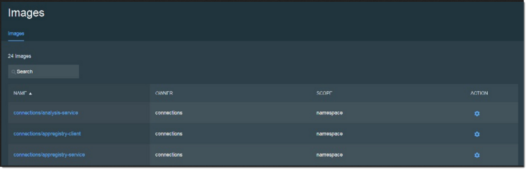
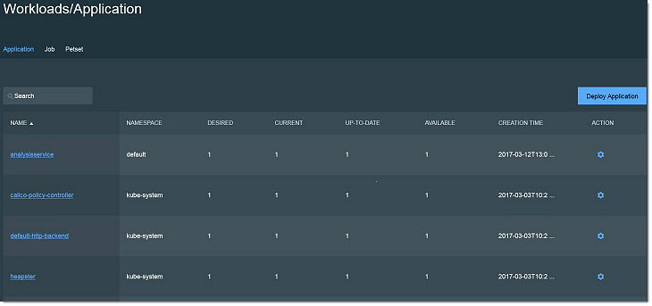

# Installing individual components with Starter Stack {#t_OM_install_Starter_Stack .task}

Install a Starter Stack to deploy the components for the service you want to deploy.

Before installing a Starter Stack, check that the following are in place:

-   You have sudo access to all servers.
-   ICp is installed and running. Check that you can access ICp in the browser at https://ipaddressofmaster:/8443/\#/login with the username: admin and the password: admin
-   Any required persistent volumes for the Starter Stack chosen are created. You can check persistent volumes at https://ipaddressofmaster:/8443/\#/storage/pvcs/
-   Hybridcloud zip file is extracted.

    **Note:** The path to the install file is in the extracted folder at /microservices/hybridcloud/install.sh. If you extracted the zip to a folder called hybrid, the path to the installer would be hybrid/microservices/hybridcloud/install.sh. For this section, we will use hybrid/microservices/hybridcloud/install.sh in examples.


1.  On the ICp master server, provide the Starter Stack you want to install to the installation script to install the images needed for your services. Starter stack components are listed in the topic [Installing Component Pack services](c_OM_install_starter_stacks.md).

    ```
    sudo hybrid/microservices/hybridcloud/install.sh -ip <StarterStack> 
    ```

    For example, for Orient Me:

    ```
    sudo hybrid/microservices/hybridcloud/install.sh -ip orientme
    
    ```

    For Customizer:

    ```
    sudo hybrid/microservices/hybridcloud/install.sh -ip customizer
    
    ```

    For ElasticSearch:

    ```
    sudo hybrid/microservices/hybridcloud/install.sh -ip elasticsearch
    
    ```

    **Note:** You can only install one Starter Stack at a time. It is not possible to uninstall a single Starter Stack. An uninstall will uninstall all components.

    **Note:** If you have changed the ICp credentials from the default, you can pass the new credentials in as arguments like so:

    ```
    sudo hybrid/microservices/hybridcloud/install.sh -ip <StarterStack> -cu username -cp password
    ```

    If these arguments are not used, and the default credentials have been changed, you will be prompted for the ICp username and password.

2.  In the browser, log into ICp dashboard and select **Infrastructure** from the  menu, then click **Images**.

    You will see the Starter Stack application images being loaded.

    

3.  In ICp in the browser, from the menu click **Workloads** and then select **Applications** to see the installed applications.

    

    **Note:** It could take up to 10 minutes for the application to display.


