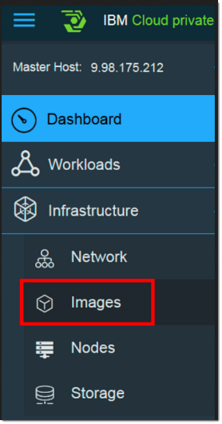
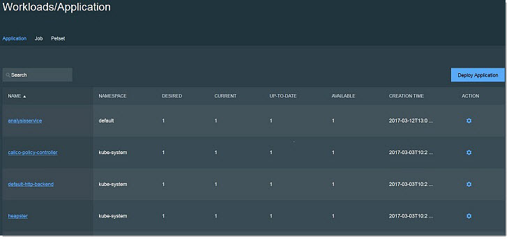

# Installing all service components {#t_install_Orient_Me_images .task}

After installing the IBM Cloud Private \(ICp\), install and configure the application images for the Component Pack.

Before you install the images, make sure that you have [set up persistent volumes](r_Orient_Me_setup_pers_vols.md) for the Mongodb, Elasticsearch, Customizer, and Solr/Zookeeper components.

1.  Check that the following items are in place:

    1.  If you are installing a clustered ICp system, you need at least three servers with network access to each other, access to HCL Connections, and all servers must at least match the minimum specification listed in [Component Pack overview](c_Orient_Me_architecture_diagrams.md).

    2.  You must have sudo access to all servers.

    3.  ICp must be installed and running. Check that you can access ICp in the browser at https://ipaddressofmaster:/8443/\#/login with the username: admin and the password: admin

    4.  Persistent volumes for MongoDB, Elasticsearch, Zookeeper, Customizer, and Solr are created. You can check this at https://ipaddressofmaster:/8443/\#/storage/pvcs/

    5.  Hybridcloud zip file is extracted.

        **Note:**

        The path to the install file is in the extracted folder at /microservices/hybridcloud/install.sh.

        If you extracted the zip to a folder called hybrid, the path to the installer would be hybrid/microservices/hybridcloud/install.sh. For this section, we will usehybrid/microservices/hybridcloud/install.sh for demonstration.

2.  On the ICp master server where you installed the application images, run the installation script to install the images needed for your services and deploy them as applications.

    ```
    sudo hybrid/microservices/hybridcloud/install.sh 
    
    ```

    **Note:** If you have changed the ICp credentials from the default, you can pass the new credentials in as arguments. For example:

    ```
     sudo hybrid/microservices/hybridcloud/install.sh -cu username -cp password
    ```

    If these arguments are not used, and the default credentials have been changed, you will be prompted for the ICp username and password.

3.  In the browser, log into ICp and from the menu  select **Infrastructure** and then click **Images**.

    

    You should see the Component Pack images being loaded.

    

    **Note:** It could take up to 10 minutes for this script to complete.

4.  In ICp in the browser, from the menu click **Workloads** and then select **Applications** to see the installed applications.

    

    **Note:** It could take up to 10 minutes for the application to display.


Once the script has finished running, you will be returned to the command prompt. As you can see from the list of populated applications, you have successfully installed all of the images for Component Pack. Now you are ready to populate Component Pack with data from Profiles and Communities.

