# List of predefined Toolbar objects {#toolbar-predefined-identifiers .reference}

Lists all available toolbar groups, menus, placeholders, and commands for Tiny Editors for HCL Connections.

## Toolbar Groups { .section}

Toolbar groups list one or more menus or commands to be included in the toolbar separated from other options. They may be user defined or be one of the predefined options listed below.

|Group ID|Contained Items|Appearance in TinyMCE|Appearance in Textbox.io|Description|
|--------|---------------|---------------------|------------------------|-----------|
|`undo`|`undo`, `redo`|||Undo mistakes.|
|`insert`|`insert`|||Insert content.|
|`style`|`styles`||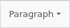|Choose from preset styles.|
|`emphasis`|`bold`, `italic`, `underline`, `permanentpen`, `casechange`|||Apply emphasis to content.|
|`align`|`alignment`||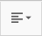|Change block alignment.|
|`listindent`|`ul`, `ol`, `checklist`, `outdent`, `indent`, `blockquote`|||Insert lists or change indentation.|
|`format`|`font-menu`, `formatpainter`, `removeformat`||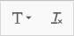|Fine control of formatting.|
|`language`|`language`, `ltrdir`, `rtldir`||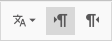|Mark sections of the document as in a language or set their text direction.|
|`tools`|`find`, `accessibility`, `fullscreen`, `usersettings`||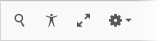|Helpful tools.|

## Toolbar Menus { .section}

Menus group multiple commands into one button. Menus contain one or more groups of commands separated by a divider. Menus include the predefined options listed below or custom menus.

|Menu ID|Contained Items|Appearance in TinyMCE|Appearance in Textbox.io|Description|
|-------|---------------|---------------------|------------------------|-----------|
|`insert`|`link`, `bookmark`, `fileupload`, `table`, `media`, `pageembed`, `hr`, `specialchar`|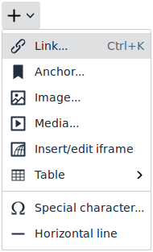|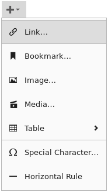|Inserting content.|
|`font-menu`|`font-face`, `font-size`, `lineheight`, `font-color`, `superscript`, `subscript`, `strikethrough`|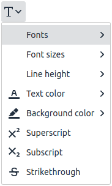|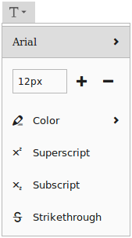|Special text styling.|
|`usersettings`|`wordcount`, `spellchecker`, `autocorrect`, `capitalization`, `help`|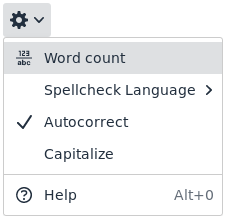|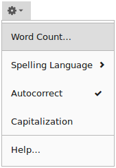|User preferences and help.|

## Placeholders for Connections specific toolbar items { .section}

Placeholders are specific to connections and expand into one or more command items conditionally based on the [location of the editor](r_plugins-locations.md).

|Placeholder ID|Appearance in TinyMCE|Appearance in Textbox.io|Description|
|--------------|---------------------|------------------------|-----------|
|`conn-emoticons`|||The `conn-emoticons` placeholder provides `emoticons` in the default editor when available for a location.|
|`conn-insert`|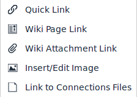|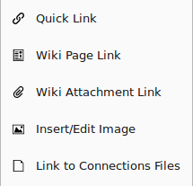|The `conn-insert` placeholder provides a list of location specific insert options. For example: Within a community, the **Link to Connections Files** is shown. This placeholder is normally used as part of a custom insert menu. The example images show the `conn-insert` menu expanded on a Wiki.|
|`conn-macros`|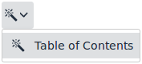|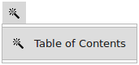|The `conn-macros` placeholder provides a menu listing any macros provided to the default editor. The images show what `conn-macros` expands to in Wikis.|
|`conn-other`| | |The `conn-other` placeholder provides buttons that are not mapped to another placeholder. Normally nothing will be displayed for this placeholder.|

## Command Items { .section}

Commands items can be placed in toolbar groups or menus.

CAUTION:

Some commands described below are not available in all editors or are only available as part of the `usersettings` menu.

|Toolbar Item ID|Appearance in TinyMCE|Appearance in Textbox.io|Description|
|---------------|---------------------|------------------------|-----------|
|`undo`|||Reverse an action that changed the editor content.|
|`redo`|||Reproduces an action that was reversed by undo.|
|`link`|||Opens the link insertion dialog.|
|`bookmark`|||Inserts a bookmark at the cursor position which can be linked to.|
|`fileupload`|||Opens the file/image upload dialog.|
|`table`|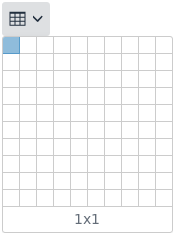|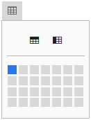|Opens the table insertion menu.|
|`specialchar`|||Opens the special character selector dialog.|
|`media`|||Opens the media embed insertion dialog.|
|`hr`|||Inserts a horizontal rule.|
|`styles`|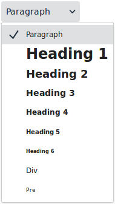|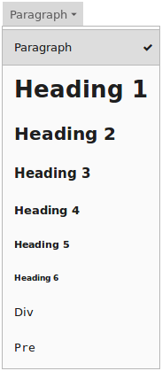|Opens the style menu.|
|`bold`|||Applies the bold style to the selection.|
|`italic`|||Applies the italic style to the selection.|
|`underline`|||Applies the underline style to the selection.|
|`strikethrough`|||Applies the strikethrough style to the selection.|
|`superscript`|||Applies the superscript style to the selection.|
|`subscript`|||Applies the subscript style to the selection.|
|`alignment`|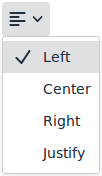|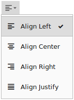|Opens the modify element alignment menu.|
|`ul`|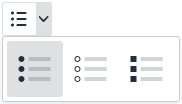|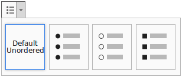|Changes the selection to an unordered list.|
|`ol`|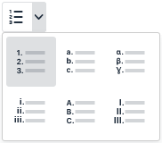|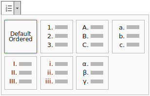|Changes the selection to an ordered list.|
|`checklist`||Not available.|Inserts a checklist. **Note:** This feature is unavailable in Textbox.io.

|
|`indent`|||Adds an indent to the selection.|
|`outdent`|||Removes an indent from the selection.|
|`blockquote`|||Changes the selection to a blockquote.|
|`font-face`|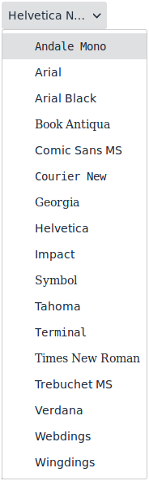|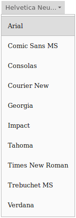|Select the font-face value from a list.|
|`font-size`|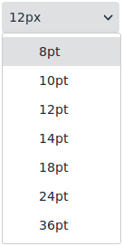||Controls for changing the font size.|
|`font-color`|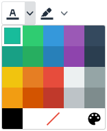|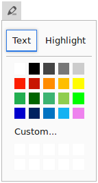|Shows the font color options. For TinyMCE this is displayed as two items, one for the text color and one for highlight color. For Textbox.io this is a single widget that allows setting both. Note that the color list is configurable.|
|`lineheight`|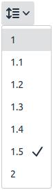|Not available.|Select the line height value from a list. **Note:** This feature is unavailable in Textbox.io.

|
|`formatpainter`||Not available.|Copies the formatting from the cursor location and applies the formatting to the selection made afterwards. **Note:** This feature is unavailable in Textbox.io.

|
|`permanentpen`||Not available.|Applies a preset format. **Note:** This feature is unavailable in Textbox.io.

|
|`pageembed`||Not available.|Inserts a configurable iframe into the content. **Note:** This feature is unavailable in Textbox.io.

|
|`casechange`|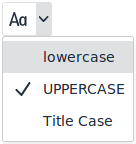|Not available.|Sets the capitalization of the selected text to upper-case, lower-case, or title-case. **Note:** This feature is unavailable in Textbox.io.

|
|`removeformat`||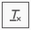|Removes all formatting from the selection.|
|`find`|||Opens the find and replace dialog.|
|`accessibility`|||Opens the accessibility checker dialog.|
|`fullscreen`|||Toggles full-screen mode.|
|`wordcount`||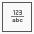|Opens the word count dialog.|
|`spellchecker`|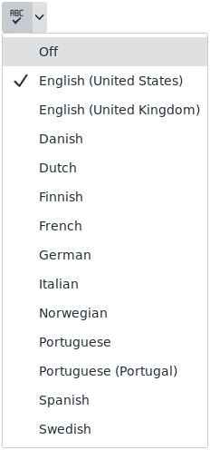|See `usersettings` menu.|Select the language used by the spellchecker. **Note:** This feature requires the spelling service to be enabled.

 **Note:** In Textbox.io this is only available as a item in the `usersettings` menu.

|
|`autocorrect`|See `usersettings` menu.|See `usersettings` menu.|Toggles auto-correction of commonly misspelled words. **Note:** This feature requires the spelling service to be enabled.

 **Note:** This feature is only available as an item in the `usersettings` menu.

|
|`capitalization`|See `usersettings` menu.|See `usersettings` menu.|Toggles auto-capitalization. **Note:** This feature requires the spelling service to be enabled.

 **Note:** This feature is only available as an item in the `usersettings` menu.

|
|`help`||See `usersettings` menu.|Shows the help dialog. **Note:** In Textbox.io this is only available as a item in the `usersettings` menu.

|
|`language`|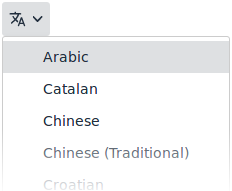|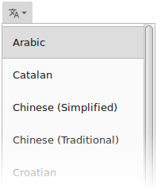|Marks the selected text as a specific language. This changes the language used to spell check the selected section of text.|
|`ltrdir`|||Marks the text direction of the selected text as left to right.|
|`rtldir`|||Marks the text direction of the selected text as right to left.|
|`emoticons`|||Opens the emoticon character selector dialog. **Note:** This option is only available to Textbox.io where it is supported in the default editor.

|
|`insertdatetime`|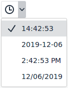|Not available.|Inserts the current date or time. **Note:** This feature is unavailable in Textbox.io.

|
|`nonbreaking`||Not available.|Allows inserting non-breaking spaces. **Note:** This feature is unavailable in Textbox.io.

|
|`preview`||Not available.|Shows a preview of the content in a popup. **Note:** This feature is unavailable in Textbox.io.

|
|`print`||Not available.|Opens the print dialog for the editor content. **Note:** This feature is unavailable in Textbox.io.

|
|`visualblocks`||Not available.|Draws boxes around all the block elements. **Note:** This feature is unavailable in Textbox.io.

|
|`visualchars`||Not available.|Gives invisible characters a background. **Note:** This feature is unavailable in Textbox.io.

|
|`codesample`||Not available.|Inserts a codesample. **Note:** This feature is unavailable in Textbox.io.

|

**Parent topic:**[Common tasks, concepts and reference information](../../install/tiny_editors/r_appendix.md)

**Related information**  

[Toolbar components and the toolbar definition](../../install/tiny_editors/c_toolbar.md)

[../../admin/install/tiny\_editors/t\_configure\_08-customize-toolbar-2.md](../../admin/install/tiny_editors/t_configure_08-customize-toolbar-2.md)

