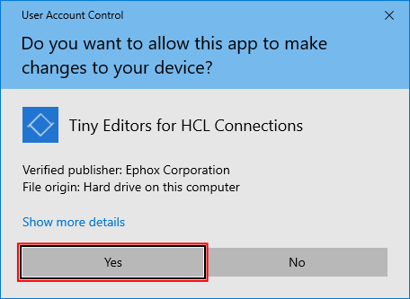
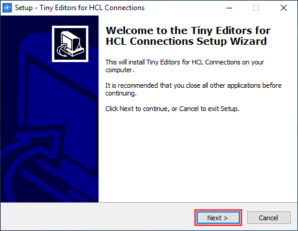
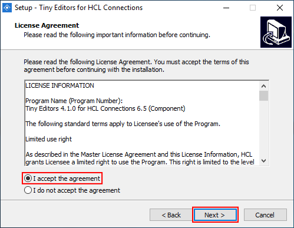
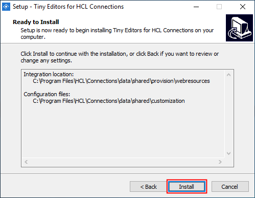
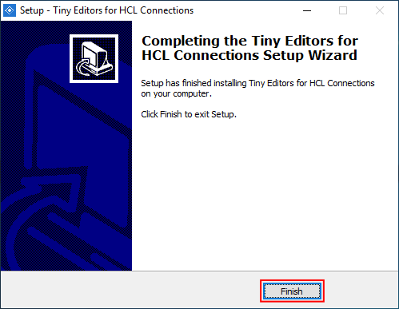

# Install on Windows {#setup-editors-install-install-on-windows .task}

The Window installation uses a Windows installer program.

Before you begin:

-   Determine the host\_name of the server hosting HCL Connections™.
-   Get user access as the HCL Connections installer or higher administrative permissions, on both:
    -   The host server.
    -   The WebSphere Application Server Console.

1.  Determine the Connections paths \(customization\_path and provision\_path\).

    1.  Log in to the web interface of the WebSphere Application Server Console.

        The default address is: https://host\_name:9043/ibm/console

    2.  Expand **Environment** and click the **WebSphere variables** link.

        

    3.  Find the **CONNECTIONS\_CUSTOMIZATION\_PATH** in the variables list and record the value which will be referred to as customization\_path from this point.

        

    4.  Find the **CONNECTIONS\_PROVISION\_PATH** in the variables list and record the value which will be referred to as provision\_path from this point.

        

2.  Stop the **Common** WebSphere enterprise application.

    1.  Log in to the web interface of the WebSphere Application Server Console.

        The default address is: https://host\_name:9043/ibm/console

    2.  Navigate to **Applications** \> **Application Types** \> **WebSphere enterprise applications**.

        

    3.  Select the checkbox for **Common** from the list of applications and click **Stop**.

        

        

3.  Run install.exe.

    The installer, install.exe, is located in the root directory of the Tiny Editors for HCL Connections package.

    **Note:** The installer may require System Administrator privileges. If prompted, click **Yes**.

    

4.  Click **Next** on the Welcome screen.

    

5.  Review the license agreement, select **I accept the agreement** and click **Next**.

    

6.  Add the customization\_path and provision\_path to the relevant input fields and continue.

    **Note:** Default paths are initially provided.

    1.  Input the provision\_path with \\webresources appended, into the **Web Resources Provisioning** field.

    2.  Input customization\_path into the **Customization** field.

    3.  Click **Next**.

    

7.  Review the installation details and click **Install**.

    

8.  Once the installation process is completed, click **Finish**.

    

9.  Follow the [post-customization steps](https://help.hcltechsw.com/connections/v6/admin/customize/t_admin_common_customize_postreq.html) to ensure the server cache is updated.

10. Start the **Common** WebSphere enterprise application.

    1.  Log in to the web interface of the WebSphere Application Server Console.

        The default address is: https://host\_name:9043/ibm/console

    2.  Navigate to **Applications** \> **Application Types** \> **WebSphere enterprise applications**.

        

    3.  Select the checkbox for **Common** from the list of applications and click **Start**.

        

        

11. Verify the install:

    1.  Browse to the following URL: http://host\_name\_and\_port/connections/resources/web/tiny.editors.connections/verify.html

        If the installation was successful, a confirmation message appears alongside the installed version numbers.

    2.  Browse to the edit screen for a wiki or blog.

        If the installation was successful, the Tiny editors will be loaded.

    **Note:** If Tiny Editors for HCL Connections is not available, [restart the Common enterprise application](t_restart-common-app.md) to force a cache update.

**Parent topic:**[Installing Tiny Editors integration](../../install/tiny_editors/t_01-setup_03-editors_02-install_00-summary.md)

