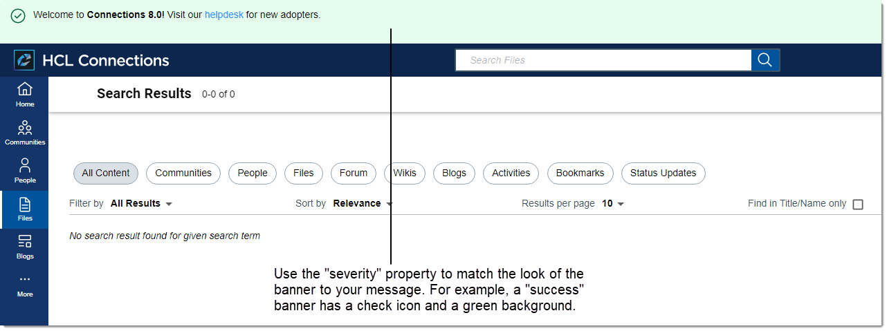
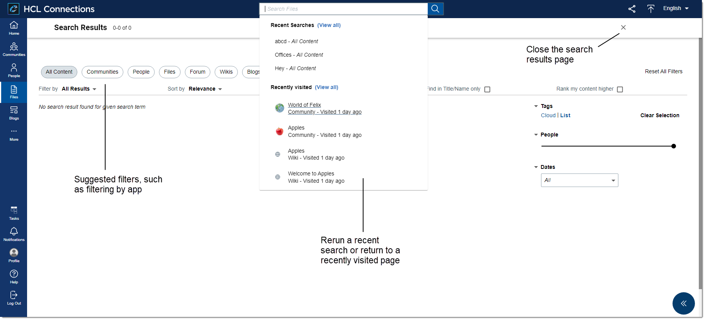
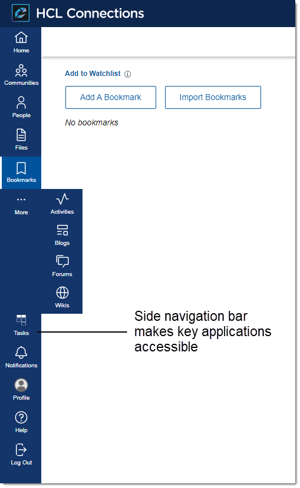
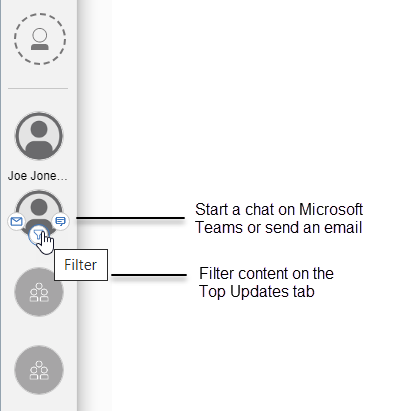

# What's new in HCL Connections {#i_ovr_r_whats_new .reference}

Find out about features that are new or updated in this release of HCL Connections.

-   See the article [Update Strategy for HCL Connections 8.0](https://support.hcltechsw.com/csm?id=kb_article&sysparm_article=KB0101180) on the HCL Support site to obtain the latest updates for both Connections Server and Component Pack, including required critical updates.

-   Download Connections 8.0 from the [HCL Software License & Download portal](https://hclsoftware.flexnetoperations.com), and Component Pack 8 from [Harbor](https://hclcr.io/harbor/projects/15/repositories).

**Attention:** Connections customers are given a transition period to upgrade their customization for the Connections 7.0 UI to the new Connections 8.0 UI. During the transition period, no defect fixes or enhancements will be made to the Connections 7.0 UI. Customers must plan to transition to the Connections 8.0 UI by HCL Connections 8.0 CR2. To switch to the 8.0 experience, see [Enabling the Connections 8.0 user experience](../migrate/enabling_cnx8_ux.md).

## What's New in HCL Connections 8.0 and Component Pack 8 {#section_hgz_3dy_clb .section}

**Technical optimization**

-   **System requirements**
    -   Refer to the [HCL Connections 8.0 System Requirements](https://support.hcltechsw.com/csm?id=kb_article&sysparm_article=KB0073654).
        -   Connections 8 requires Java 8, so you need to upgrade Security Directory Integrator 7.2. For more information, see [Deploying Security Directory Integrator into a new install of Connections](../install/t_prof_tdi_new_deploy.md).
    -   For Component Pack 8, see [Prerequisites for Component Pack](../install/cp_prereqs.md).
-   **Connections and Component Pack - automating your install and sizing your deployment**
    -   HCL's open-source GitHub documents provide details on setting up end-to-end automation to install Connections and Component Pack. The respective Git locations are:
        -   [Quickstart for setting up HCL Connections and Component Pack using Ansible automation](https://github.com/HCL-TECH-SOFTWARE/connections-automation/blob/main/documentation/QUICKSTART.md)
        -   [HCL Connections and Component Pack automation scripts](https://github.com/HCL-TECH-SOFTWARE/connections-automation/blob/main/README.md)
    -   [HCL Connections 8.0 Sizing Guide](https://opensource.hcltechsw.com/connections-doc/v8/guide_me/how_to_guides/connections8_sizing_guide.pdf): Provides sizing and deployment recommendations for both Connections and Component Pack, based on HCL performance tests and best practices learned and confirmed by multiple customers through time.
-   **Component Pack**
    -   For supported versions of components, for example Kubernetes and Helm, refer to the table in the [HCL Connections 8.0 System Requirements](https://support.hcltechsw.com/csm?id=kb_article&sysparm_article=KB0073654).
    -   Component Pack is now installed from Harbor instead of a local Docker registry.

-   **Roadmap to Connections and Component Pack**
    -   **Connections 8.0**: See [Installing Connections](../install/c_installing.md) or [Upgrading and updating](../migrate/c_upgrade_migrate_overview.md).
    -   **Component Pack 8**: Component Pack for HCL Connections introduces several offerings that enhance collaboration and boost productivity. Upgrading to Component Pack 8 requires the replacement of MongoDB 3 with 5, and Elasticsearch 7 with OpenSearch. Refer to [Installing and upgrading Component Pack for Connections](../install/cp_install_config_intro.md).
    -   Check which new features are supported for a Component Pack and non-Component Pack deployment in [Supported features for Connections 8.0 deployments](../plan/supported_features.md).

**Community surveys are no longer supported in Connections 8.0.**

LEAP will replace community surveys in an upcoming release.

**TinyMCE editor is only supported in the Connections 7 UI.**

TinyMCE editor will be fully supported in the Connections 8.0 UI in Connections 8.0 CR1.

## Promote your message using a site-wide banner {#section_us1_5vs_v5b .section}

Share important news and announcements within Connections using the administrative banner – the banner displays your message at the top of every Connections page for high visibility. You can control the content and functionality of the banner, including how it looks on the page, by configuring its properties.

Depending on your deployment, you can set it up through the app registry or using Feature Foundation. For details, see [Administering the display of a site-wide banner](../admin/admin_banner_onprem.md).

## Search from anywhere in Connections {#section_nd4_w23_dvb .section}

An updated search experience from start-to-find:

-   **Simplified search box**
    -   Central and constant location so you can run a search from any page in Connections
    -   Context-sensitive focus means the scope of the search intuitively adjusts to the current app
    -   Access to commonly used resources, that is recent searches and recently viewed content
-   **Redesigned results page**
    -   Intuitive filtering effortlessly broadens or narrows the scope of your search for more relevant results
    -   Closing out the search results page takes you exactly where you left off before

Refer to [Administering Search](../admin/c_admin_search.md) and [Searching Connections](../../user/eucommon/c_eucommon_search.md).

## More usable and intuitive navigation {#section_qls_z23_dvb .section}

A clear and consistent design reduces the clicks and steps, saving time and effort.

Easier customization also allows you to:

-   Add your most-used applications to the side navigation bar so they're always in reach
-   Tailor the look of the top navigation – the logo, color, and environment name – to reflect your own branding

For more information, see [Customizing the navigation bar](../customize/t_admin_navbar_create_files.md).

## Quick access to important contacts {#section_omd_bf3_dvb .section}

Pinned contacts and communities are available everywhere in Connections for instant interaction:

-   Click an avatar to open a community's landing page.
-   Hover on a person's avatar for shortcuts to connect and to view their business card. For further information on using the filter icon, refer to [Top Updates: Keeping up with what's most relevant to you](../../user/homepage/Tile_homepage_using.md).

See [Adding an Important To Me bar to a Connections component](../customize/c_itm_iframe_intro.md).

**Cloud Native Initiative**

Continuing on the path to drive down the total cost of ownership of Connections, specifically for the Component pack, HCL Connections now supports Amazon AWS, EC2, ECS, EKS, and Fargate, and Red Hat Open Shift.

**Interested in Connections Mobile?**

Check out the App Store for iOS or Google Play for Android for the latest information and release. Refer to [HCL Connections Mobile](https://help.hcltechsw.com/connectionsmobile/index.html) product documentation for additional information.

**What's new for end users**

For more information about new end-user features and functions in HCL Connections 8.0, see [What's new in HCL Connections?](../../user/eucommon/r_eucommon_whats_new.md)

