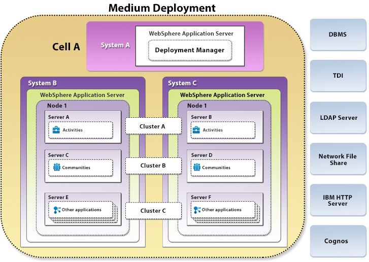
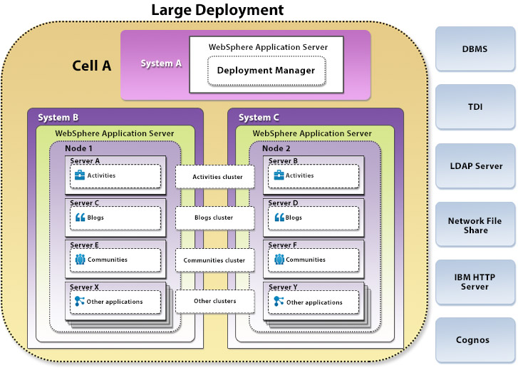

# Deployment options {#c_planning_the_installation .concept}

Install HCL Connections™ in one of three deployment topologies to achieve optimum scaling, load balancing, and failover.

A network deployment can consist of a single server that hosts all Connections applications or two or more sets of clustered servers that share the workload. You must configure an additional system with WebSphere® Application Server Network Deployment Manager.

A network deployment provides the administrator with a central management facility and it ensures that users have constant access to data. It balances the workload between servers, improves server performance, and facilitates the maintenance of performance when the number of users increases. The added reliability also requires a larger number of systems and the experienced administrative personnel who can manage them.

Any of these deployments can be set up to allow employees and external users to work together. After you install Connections, you must register external users manually and then add them to the Profiles database.

**Best practices guide:** For the latest deployment recommendations for both Connections and Component Pack, see [HCL Connections and Component Pack Sizing Guide](https://opensource.hcltechsw.com/connections-doc/v8/guide_me/how_to_guides/connections8_sizing_guide.pdf). The guide is based on HCL performance tests and best practices learned and confirmed by multiple customers through time.

When you are installing Connections, you have three deployment options:

Small deployment
:   Install all Connections applications on a single node in a single cluster. This option is the simplest deployment but has limited flexibility and does not allow individual applications to be scaled up. All the applications run within a single Java™ Virtual Machine \(JVM\).

    **Note:** The diagram depicts a topology with up to 8 servers. If you install the servers on shared systems, you do not need to deploy 8 separate systems.

    

Medium deployment
:   Install a subset of applications in separate clusters. Connections provides five predefined cluster names shared among all of its applications. Use this option to distribute applications according to your usage expectations. For instance, you might anticipate higher loads for the Profiles application and install it in its own cluster, while other applications could be installed in a different cluster. This option allows you to maximize the use of available hardware and system resources to suit your needs.

    

Large deployment
:   Install each application in its own cluster. Connections provides a predefined cluster name for each application. This option provides the best performance in terms of scalability and availability options but also requires more system resources. In most cases, you should install the News and Home page applications in the same cluster.

    

**Notes:**

-   In a multi-node cluster, you must configure network share directories as shared content stores. When using NFS, use NFS v4 because NFS v3 lacks advanced locking capability. When using Microsoft™ SMB Protocol for file-sharing, use the UNC file-naming convention; for example: \\\\machine-name\\share-name.

    **Tip:** For shared and remote network file system requirements, review the footnotes for each supported operating system in the detailed [system requirements](https://support.hcltechsw.com/csm?sys_kb_id=2010cc82db30acd0a45ad9fcd3961971&id=kb_article_view).

-   You can assign various combinations of applications to clusters in many different ways, depending on your usage and expectations. For more information, visit the Connections wiki to read articles about deployment.
-   The number of JVMs that you need for each cluster depends on the user population and workload. For failover, you must have two JVMs per application, or two nodes for each cluster, scaled horizontally. Horizontal scaling refers to having multiple JVMs per application with each JVM running on a WebSphere Application Server instance. Vertical scaling refers to running multiple JVMs for the same application on a single WebSphere Application Server instance. Vertical scaling is not officially supported in Connections. However, it is typically not needed unless your server has several CPUs.
-   For performance and security reasons, consider using a proxy server in your deployment.
-   For added security when you are planning to run 3rd party OpenSocial gadgets, such as those from iGoogle, you must configure locked domains. Locked domains are required to isolate these gadgets from access to your intranet and SSO information. The basic configuration of locked domains is as follows:

    -   A second top-level domain that is not in your SSO domain. For example, if you organization's SSO domain is example.com, you will require a distinct top level domain, such as example-modules.com.
    -   A wild card SSL certificate for this domain name.
    No additional server instances are required for the basic configuration. See [Enabling locked domains](../install/t_post_install_cre11_conn_security_locked.md) for more details.

-   If you use Forms, Viewer, Polls, or Surveys, your deployment topology requires additional servers.

**Parent topic:**[Planning](../plan/c_installation_overview.md)

