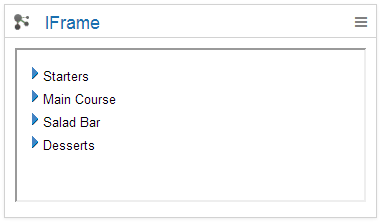

# IFrame {#cec_iframe_cloud .reference}

Embed an iFrame widget to the Connections Engagement Center.

Use the HCL Connections proxy to access to HTTP sites.

## Content source { .section}

Source is the website that you enter in the URL input field. The information of the site will be transferred directly to the Connections Engagement Center.

## Expected format { .section}

The source of the IFrame widget should be able to be shown in an IFrame. The screenshot of the IFrame widgets shows the web view of an IBM Notes application. There is only some information about a menu. If you try to display a whole website you will see that there is not enough space to show it complete.

## Configuration options for Admin/Page Editor { .section}

Personalization

Use Proxy

**Note:** If you select the Use Proxy option, the proxy returns only HTML, so some additional content \(such as referenced images\) will not be returned.

## Other { .section}

To use the HCL Connections proxy, a proxy server must be configured for the deployment. For more information, see [Configuring a whitelist for the proxy server](cec-rss-cloud-configure.md).

