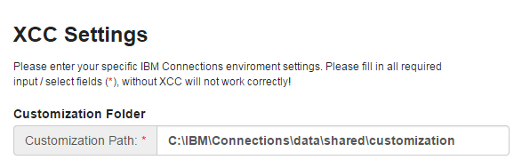
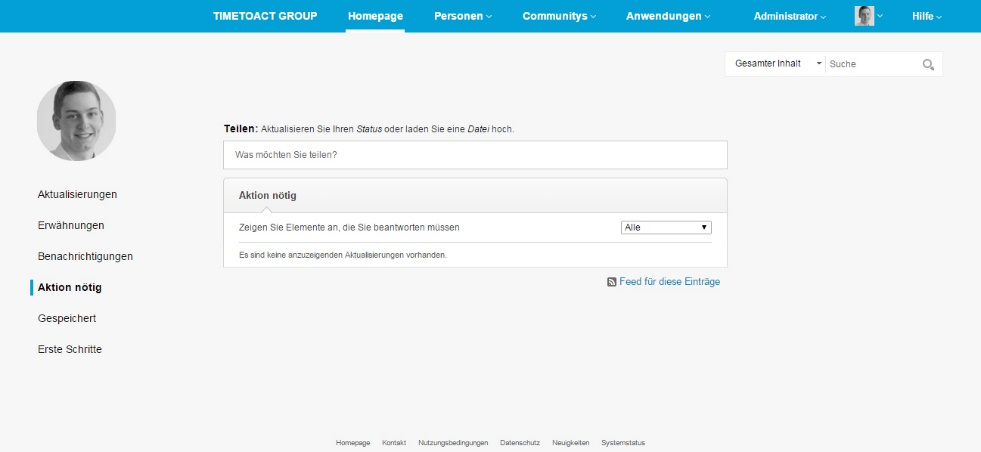
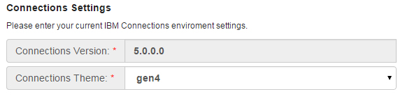
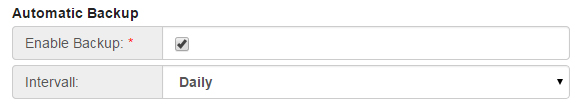

# General configuration {#id_name .reference}

After installing Connections Engagement Center you will see a configuration page. Here you can set up Connections Engagement Center configurations in your browser. If you want to make changes later, you can open the configuration page manually **https://<your\_server\>/xcc/admin** and edit your settings.

|Step|Instructions|
|----|------------|
|**1**

|**Context-Roots:**

 First make sure to save the Connections Context Roots by clicking the save Button in the lower right corner.

 You will be redirected to the Connections Engagement Center-Page where you can enter a license key. If you are not being redirected, please open the Connections Engagement Center-Page \(https://<server\>/xcc/main\) manually and enter your license key.

|
|**2**

|**Customization Path:**

 Navigate to the Admin Dashboard \(https://<server\>/xcc/admin\). Please navigate to Connections Environment via the navigation on the left side. The customization path is required for backing up Connections Engagement Center pages in XML format. Please note that this path should be the same path that you configured in your system's WebSphere Environment Variables under CONNECTIONS\_CUSTOMIZATION\_PATH.

 

 **Windows:**

 **file system:** C:\\IBM\\Connections\\data\\shared\\customization

 **network path:** \\\\sharednetwork.cnx.local\\icshare\\customization

 **Linux:**

 **file system:** /opt/IBM/Connections/data/shared/customization

 **network path:** //sharednetwork.cnx.local/icshare/customization

|
|**3**

|**Connections Themes:**

 At this release, only the Hikari theme is available; which looks like the following image.

 **hikariTheme:**

 

|
|**4**

|**Connections Settings:**

 To allow Connections Engagement Center to adopt your Connections layout, please fill out the fields **Connections Version** \(only necessary, if we cannot get the information automatically\) and **Connections Theme**.

 

|
|**5**

|**Automatic Backup:**

 Check the Enable Backup property in the Backup tab, if you want to enable the automatic backup feature. Select one of three options: Daily, weekly or monthly to set up the backup schedule respectively.

 By default, automatic backup is disabled for the Connections Engagement Center application.

 

|

**Parent topic:**[Configuring](../../connectors/icec/cec-inst-configuring.md)

