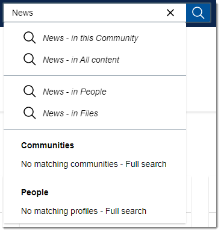

# Performing a search {#concept_ygr_2l1_ty .concept}

Use one centralized search box to search for anything in HCL Connections.

With Connections search, you can often find what you're looking for without leaving the current page by just clicking one of the suggestions following your entry. If not, one click gets you to a full search page where you can easily use a variety of filters to broaden or narrow the scope.

To perform a search:

1.  Click in the search box to bring up a list of recent searches and recently visited pages. To expand either list, click **View all**.
2.  In the search box, begin typing a word or phrase. Then do one of the following:
    -   Finish typing and choose a suggested scope, for example *in this Community*, which takes you to a full search results page filtered by that scope. Or just click the search icon to display the results for all content, and choose the filters you want then.

        

    -   Click one of the typeahead suggestions to open the relevant community or profile.
3.  On the search results page, you can filter your search results. Here are some tasks you can do with filters:

    -   Filter the results by app and by one or more tags, people, and dates.
    -   Use the **Filter by** field to see only content that you created, made comments to, and so on.
    -   Broaden the scope of the search, for example if you started searching from a community wiki, you can easily expand your search to include all content in that community or across all of Connections.
    **Tip:** To see all content related to you across Connections, use your name as the search term and then on the results page set the **Filter by** field to **My Content**.

    For more on filtering, see [Filtering search results](t_eucommon_view_search_results.md).

4.  When done with your search, you can click the **close search** icon  beside the title bar to return to the page you were last viewing.

**Note:** The full features mentioned require that your organization has deployed Component Pack for Connections. If your organization doesn't have Component Pack and you still don't see the results you want, click **Advanced Search**. For information on the advanced search page, see [Performing an advanced search](t_eucommon_perform_advanced_search.md).

**Parent topic:**[Searching Connections](../eucommon/c_eucommon_search.md)

